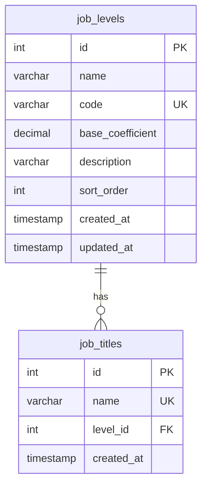

# 📊 职级管理功能说明

## 🎯 功能概述

新增了**职级管理**模块，用于管理员工的职级体系。职级可以与职称关联，形成完整的职业发展路径。

---

## 📋 数据模型

### 1. 职级表 (`job_levels`)

| 字段 | 类型 | 说明 |
|------|------|------|
| `id` | INT | 主键 |
| `name` | VARCHAR(100) | 职级名称（如：初级、中级、高级） |
| `code` | VARCHAR(50) | 职级编码（如：junior, mid, senior） |
| `base_coefficient` | DECIMAL(4,2) | 基础系数（默认 1.0） |
| `description` | VARCHAR(500) | 职级描述 |
| `sort_order` | INT | 排序顺序 |
| `created_at` | TIMESTAMP | 创建时间 |
| `updated_at` | TIMESTAMP | 更新时间 |

### 2. 职称表 (`job_titles`) - 已更新

| 字段 | 类型 | 说明 | 变更 |
|------|------|------|------|
| `id` | INT | 主键 | - |
| `name` | VARCHAR(255) | 职称名称 | - |
| `level_id` | INT | 关联职级 ID | **新增** |
| `created_at` | TIMESTAMP | 创建时间 | - |

**外键关系**:
- `level_id` → `job_levels(id)` ON DELETE SET NULL

---

## 🔌 API 接口

### 职级管理 (`/api/job-levels`)

#### 1. GET /api/job-levels
获取所有职级列表

**响应示例**:
```json
[
  {
    "id": 1,
    "name": "初级",
    "code": "junior",
    "base_coefficient": 1.10,
    "description": "初级职称，适用于入职 1-3 年的员工",
    "sort_order": 1,
    "created_at": "2026-03-19T10:00:00.000Z",
    "updated_at": "2026-03-19T10:00:00.000Z"
  },
  {
    "id": 2,
    "name": "中级",
    "code": "mid",
    "base_coefficient": 1.00,
    "description": "中级职称，适用于入职 3-5 年的员工",
    "sort_order": 2,
    "created_at": "2026-03-19T10:00:00.000Z",
    "updated_at": "2026-03-19T10:00:00.000Z"
  }
]
```

---

#### 2. POST /api/job-levels
创建新职级

**请求体**:
```json
{
  "name": "专家级",
  "code": "expert",
  "base_coefficient": 0.8,
  "description": "专家级职称，适用于资深专业人士",
  "sort_order": 4
}
```

**成功响应** (201):
```json
{
  "id": 4,
  "name": "专家级",
  "code": "expert",
  "base_coefficient": 0.80,
  "description": "专家级职称，适用于资深专业人士",
  "sort_order": 4,
  "created_at": "...",
  "updated_at": "..."
}
```

**错误响应** (400):
```json
{
  "error": "职级名称和编码不能为空"
}
```

---

#### 3. PUT /api/job-levels/:id
更新职级信息

**请求体**:
```json
{
  "name": "高级工程师",
  "code": "senior_eng",
  "base_coefficient": 0.85,
  "description": "更新后的描述",
  "sort_order": 3
}
```

---

#### 4. DELETE /api/job-levels/:id
删除职级

**约束**:
- 如果有职称关联此职级，则无法删除
- 需要先修改相关职称的职级关联

**错误响应** (400):
```json
{
  "error": "还有 3 个职称使用此职级，请先修改后再删除"
}
```

---

### 职称管理 (`/api/job-titles`) - 已更新

#### 1. GET /api/job-titles
获取所有职称列表（包含职级信息）

**响应示例**:
```json
[
  {
    "id": 1,
    "name": "软件工程师",
    "level_id": 2,
    "level_name": "中级",
    "level_code": "mid",
    "created_at": "..."
  },
  {
    "id": 2,
    "name": "架构师",
    "level_id": 3,
    "level_name": "高级",
    "level_code": "senior",
    "created_at": "..."
  }
]
```

---

#### 2. POST /api/job-titles
创建新职称（可关联职级）

**请求体**:
```json
{
  "name": "技术专家",
  "level_id": 4  // 可选，关联的职级 ID
}
```

**验证**:
- 如果提供了 `level_id`，会验证该职级是否存在
- `level_id` 可以为 null（不关联任何职级）

---

#### 3. PUT /api/job-titles/:id
更新职称（可修改关联的职级）

**请求体**:
```json
{
  "name": "高级技术专家",
  "level_id": 3  // 修改关联的职级
}
```

---

## 💡 使用场景

### 场景 1：建立职级体系

```bash
# 创建职级
POST /api/job-levels
{
  "name": "实习生",
  "code": "intern",
  "base_coefficient": 1.2,
  "description": "实习期员工",
  "sort_order": 0
}

# 创建更多职级...
```

### 场景 2：为职称分配职级

```bash
# 创建职称时关联职级
POST /api/job-titles
{
  "name": "前端开发工程师",
  "level_id": 2  // 中级
}

# 或更新现有职称的职级
PUT /api/job-titles/1
{
  "name": "资深前端工程师",
  "level_id": 3  // 升级为高级
}
```

### 场景 3：查询带职级的职称信息

```bash
GET /api/job-titles

# 返回：
[
  {
    "id": 1,
    "name": "前端开发工程师",
    "level_name": "中级",
    "level_code": "mid"
  }
]
```

---

## 🔄 数据库迁移

### 自动执行

系统启动时会自动：
1. 创建 `job_levels` 表
2. 在 `job_titles` 表中添加 `level_id` 字段和外键
3. 插入默认职级数据（初级、中级、高级）

### 默认职级数据

| ID | 名称 | 编码 | 系数 | 描述 | 排序 |
|----|------|------|------|------|------|
| 1 | 初级 | junior | 1.1 | 初级职称，适用于入职 1-3 年的员工 | 1 |
| 2 | 中级 | mid | 1.0 | 中级职称，适用于入职 3-5 年的员工 | 2 |
| 3 | 高级 | senior | 0.9 | 高级职称，适用于入职 5 年以上的员工 | 3 |

---

## ⚠️ 注意事项

### 1. 数据完整性

- 删除职级前必须先解除与职称的关联
- 职级名称和编码必须唯一
- `base_coefficient` 默认为 1.0

### 2. 业务逻辑

- 一个职级可以关联多个职称
- 一个职称只能关联一个职级（或不关联）
- 职级编码 (`code`) 应与原有的 `level` 字段对应

### 3. 向后兼容

保留了原有的 `level_coefficients` 表和 `users.level` 字段，确保向后兼容。

---

## 📊 ER 图



---

## 🧪 测试建议

### 1. 单元测试

```javascript
// 测试创建职级
test('should create job level with valid data', async () => {
  const level = await createJobLevel({
    name: '测试级',
    code: 'test',
    base_coefficient: 1.0
  });
  expect(level.name).toBe('测试级');
});

// 测试删除有关联的职级
test('should not delete job level with associated titles', async () => {
  // ...
});
```

### 2. 集成测试

```javascript
// 测试完整的职级 - 职称流程
test('should associate job title with job level', async () => {
  const level = await createJobLevel({...});
  const title = await createJobTitle({
    name: '测试职称',
    level_id: level.id
  });
  expect(title.level_id).toBe(level.id);
});
```

---

## 🚀 下一步计划

### 前端实现

1. **职级管理页面**
   - 列表展示（表格）
   - 新增/编辑对话框
   - 删除确认
   
2. **职称管理页面更新**
   - 添加职级选择下拉框
   - 显示当前关联的职级
   - 支持修改职级关联

3. **用户管理页面更新**
   - 考虑是否需要显示员工的职级信息

### 功能扩展

1. **职级晋升流程**
   - 记录职级变更历史
   - 设置晋升条件

2. **系数计算**
   - 在评分时使用职级系数
   - 自动计算最终得分

3. **统计分析**
   - 各职级人数分布
   - 职级变化趋势

---

**更新时间**: 2026-03-19  
**版本**: v1.0
